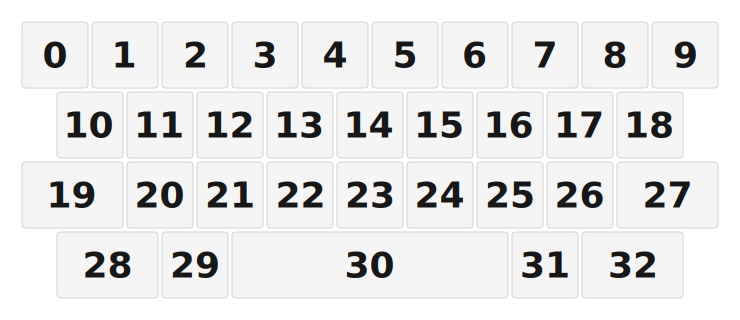

# ZMK Configuration for corea

*Generated by Shield Wizard for ZMK*



Download compiled firmware from the Actions tab. <https://zmk.dev/docs/user-setup#installing-the-firmware>

Edit your keymap <https://zmk.dev/docs/keymaps>.
User keymap is located at [`config/corea.keymap`](config/corea.keymap).

-----

<details>
<summary>
Shield Wizard Debug Information
</summary>

In case of broken configuration, here is the Shield Wizard internal data used to generate this configuration:

Commit: 8a52249f61161469b6d90ed8c80c4aa52b9f3858

```json
{"name":"corea","shield":"corea","dongle":false,"modules":[],"layout":[{"id":"01KHE5XG23M3ZEGXFPRTPE05J7","part":0,"row":0,"col":0,"w":1,"h":1,"x":0,"y":0,"r":0,"rx":0,"ry":0},{"id":"01KHE5XG233FPV1ACF54WJNPG7","part":0,"row":0,"col":1,"w":1,"h":1,"x":1,"y":0,"r":0,"rx":0,"ry":0},{"id":"01KHE5XG237TM2Z071GHN0R6E4","part":0,"row":0,"col":2,"w":1,"h":1,"x":2,"y":0,"r":0,"rx":0,"ry":0},{"id":"01KHE5XG236WJA397001ESNP0F","part":0,"row":0,"col":3,"w":1,"h":1,"x":3,"y":0,"r":0,"rx":0,"ry":0},{"id":"01KHE5XG23CJ7ZAMWT4722V5YH","part":0,"row":0,"col":4,"w":1,"h":1,"x":4,"y":0,"r":0,"rx":0,"ry":0},{"id":"01KHE5XG23JR4S19QE7JRZMNW1","part":0,"row":0,"col":5,"w":1,"h":1,"x":5,"y":0,"r":0,"rx":0,"ry":0},{"id":"01KHE5XG23SASRNA0Z5NHQS4NN","part":0,"row":0,"col":6,"w":1,"h":1,"x":6,"y":0,"r":0,"rx":0,"ry":0},{"id":"01KHE5XG23H07WDSZ2J02XT82P","part":0,"row":0,"col":7,"w":1,"h":1,"x":7,"y":0,"r":0,"rx":0,"ry":0},{"id":"01KHE5XG23SJG575FNZRAF8X04","part":0,"row":0,"col":8,"w":1,"h":1,"x":8,"y":0,"r":0,"rx":0,"ry":0},{"id":"01KHE5XG23E2Y6RM14TN2XASAM","part":0,"row":0,"col":9,"w":1,"h":1,"x":9,"y":0,"r":0,"rx":0,"ry":0},{"id":"01KHE5XG2312TFN38PBJ7W8GFX","part":0,"row":1,"col":0,"w":1,"h":1,"x":0.5,"y":1,"r":0,"rx":0,"ry":0},{"id":"01KHE5XG23ZCD9GC4SKHKHCJ77","part":0,"row":1,"col":1,"w":1,"h":1,"x":1.5,"y":1,"r":0,"rx":0,"ry":0},{"id":"01KHE5XG23BN5NFK3JTPRYWT5K","part":0,"row":1,"col":2,"w":1,"h":1,"x":2.5,"y":1,"r":0,"rx":0,"ry":0},{"id":"01KHE5XG239T4J6NAW6W4PRYR6","part":0,"row":1,"col":3,"w":1,"h":1,"x":3.5,"y":1,"r":0,"rx":0,"ry":0},{"id":"01KHE5XG23YSP1JNV0FM476FZZ","part":0,"row":1,"col":4,"w":1,"h":1,"x":4.5,"y":1,"r":0,"rx":0,"ry":0},{"id":"01KHE5XG23574JHR4ZFGRYG0KD","part":0,"row":1,"col":5,"w":1,"h":1,"x":5.5,"y":1,"r":0,"rx":0,"ry":0},{"id":"01KHE5XG23KB4B91PKH66TV385","part":0,"row":1,"col":6,"w":1,"h":1,"x":6.5,"y":1,"r":0,"rx":0,"ry":0},{"id":"01KHE5XG23E49B3YBP2B27G34J","part":0,"row":1,"col":7,"w":1,"h":1,"x":7.5,"y":1,"r":0,"rx":0,"ry":0},{"id":"01KHE5XG23JFA956134MGW47Y0","part":0,"row":1,"col":8,"w":1,"h":1,"x":8.5,"y":1,"r":0,"rx":0,"ry":0},{"id":"01KHE5XG23G7ZKJG38MZ1QH1RX","part":0,"row":2,"col":0,"w":1.5,"h":1,"x":0,"y":2,"r":0,"rx":0,"ry":0},{"id":"01KHE5XG23NC6VGK9HTRT9ZJTN","part":0,"row":2,"col":1,"w":1,"h":1,"x":1.5,"y":2,"r":0,"rx":0,"ry":0},{"id":"01KHE5XG23ASJVNM4ZA8E459HR","part":0,"row":2,"col":2,"w":1,"h":1,"x":2.5,"y":2,"r":0,"rx":0,"ry":0},{"id":"01KHE5XG23DWNS0WHHRVY1ZFC8","part":0,"row":2,"col":3,"w":1,"h":1,"x":3.5,"y":2,"r":0,"rx":0,"ry":0},{"id":"01KHE5XG232TYA9AG36DKX61PW","part":0,"row":2,"col":4,"w":1,"h":1,"x":4.5,"y":2,"r":0,"rx":0,"ry":0},{"id":"01KHE5XG23KP5EWBGVJRYCNQSB","part":0,"row":2,"col":5,"w":1,"h":1,"x":5.5,"y":2,"r":0,"rx":0,"ry":0},{"id":"01KHE5XG23T2CXJN7BZWM6CEDR","part":0,"row":2,"col":6,"w":1,"h":1,"x":6.5,"y":2,"r":0,"rx":0,"ry":0},{"id":"01KHE5XG23ABA4TR4V94S8AB4E","part":0,"row":2,"col":7,"w":1,"h":1,"x":7.5,"y":2,"r":0,"rx":0,"ry":0},{"id":"01KHE5XG23XSYG53BGJ4B132CN","part":0,"row":2,"col":8,"w":1.5,"h":1,"x":8.5,"y":2,"r":0,"rx":0,"ry":0},{"id":"01KHE5XG23NFMGF68JGR5DEJPQ","part":0,"row":3,"col":0,"w":1.5,"h":1,"x":0.5,"y":3,"r":0,"rx":0,"ry":0},{"id":"01KHE5XG23CA2ZD9WECZVXRZKP","part":0,"row":3,"col":2,"w":1,"h":1,"x":2,"y":3,"r":0,"rx":0,"ry":0},{"id":"01KHE5XG235VENR20KK72ZSEXA","part":0,"row":3,"col":4,"w":4,"h":1,"x":3,"y":3,"r":0,"rx":0,"ry":0},{"id":"01KHE5XG233S3MNCFAQDW0B575","part":0,"row":3,"col":7,"w":1,"h":1,"x":7,"y":3,"r":0,"rx":0,"ry":0},{"id":"01KHE5XG232RY61ZCQT0F28EQZ","part":0,"row":3,"col":8,"w":1.5,"h":1,"x":8,"y":3,"r":0,"rx":0,"ry":0}],"parts":[{"name":"unibody","controller":"nice_nano_v2","wiring":"matrix_diode","keys":{"01KHE5XG232RY61ZCQT0F28EQZ":{"output":"d9","input":"d14"},"01KHE5XG233S3MNCFAQDW0B575":{"output":"d9","input":"d15"},"01KHE5XG235VENR20KK72ZSEXA":{"output":"d9","input":"d20"},"01KHE5XG23CA2ZD9WECZVXRZKP":{"output":"d9","input":"d6"},"01KHE5XG23NFMGF68JGR5DEJPQ":{"output":"d9","input":"d5"},"01KHE5XG23XSYG53BGJ4B132CN":{"output":"d10","input":"d14"},"01KHE5XG23ABA4TR4V94S8AB4E":{"output":"d10","input":"d15"},"01KHE5XG23T2CXJN7BZWM6CEDR":{"output":"d10","input":"d18"},"01KHE5XG23KP5EWBGVJRYCNQSB":{"output":"d10","input":"d19"},"01KHE5XG232TYA9AG36DKX61PW":{"output":"d10","input":"d20"},"01KHE5XG23DWNS0WHHRVY1ZFC8":{"output":"d10","input":"d7"},"01KHE5XG23ASJVNM4ZA8E459HR":{"output":"d10","input":"d6"},"01KHE5XG23NC6VGK9HTRT9ZJTN":{"output":"d10","input":"d5"},"01KHE5XG23G7ZKJG38MZ1QH1RX":{"output":"d10","input":"d4"},"01KHE5XG23JFA956134MGW47Y0":{"output":"d8","input":"d14"},"01KHE5XG23E49B3YBP2B27G34J":{"output":"d8","input":"d15"},"01KHE5XG23KB4B91PKH66TV385":{"output":"d8","input":"d18"},"01KHE5XG23574JHR4ZFGRYG0KD":{"output":"d8","input":"d19"},"01KHE5XG23YSP1JNV0FM476FZZ":{"output":"d8","input":"d20"},"01KHE5XG239T4J6NAW6W4PRYR6":{"output":"d8","input":"d7"},"01KHE5XG23BN5NFK3JTPRYWT5K":{"output":"d8","input":"d6"},"01KHE5XG23ZCD9GC4SKHKHCJ77":{"output":"d8","input":"d5"},"01KHE5XG2312TFN38PBJ7W8GFX":{"output":"d8","input":"d4"},"01KHE5XG23E2Y6RM14TN2XASAM":{"output":"d16","input":"d14"},"01KHE5XG23SJG575FNZRAF8X04":{"output":"d16","input":"d15"},"01KHE5XG23H07WDSZ2J02XT82P":{"output":"d16","input":"d18"},"01KHE5XG23SASRNA0Z5NHQS4NN":{"output":"d16","input":"d19"},"01KHE5XG23JR4S19QE7JRZMNW1":{"output":"d16","input":"d20"},"01KHE5XG23CJ7ZAMWT4722V5YH":{"output":"d16","input":"d7"},"01KHE5XG236WJA397001ESNP0F":{"output":"d16","input":"d6"},"01KHE5XG237TM2Z071GHN0R6E4":{"output":"d16","input":"d5"},"01KHE5XG233FPV1ACF54WJNPG7":{"output":"d16","input":"d4"},"01KHE5XG23M3ZEGXFPRTPE05J7":{"output":"d16","input":"d2"}},"encoders":[],"pins":{"d9":"output","d10":"output","d8":"output","d16":"output","d2":"input","d4":"input","d5":"input","d6":"input","d7":"input","d20":"input","d19":"input","d18":"input","d15":"input","d14":"input"},"buses":[{"type":"spi","name":"spi0","devices":[]},{"type":"spi","name":"spi1","devices":[]},{"type":"spi","name":"spi2","devices":[]},{"type":"spi","name":"spi3","devices":[]},{"type":"i2c","name":"i2c0","devices":[]},{"type":"i2c","name":"i2c1","devices":[]}]}]}
```

</details>
